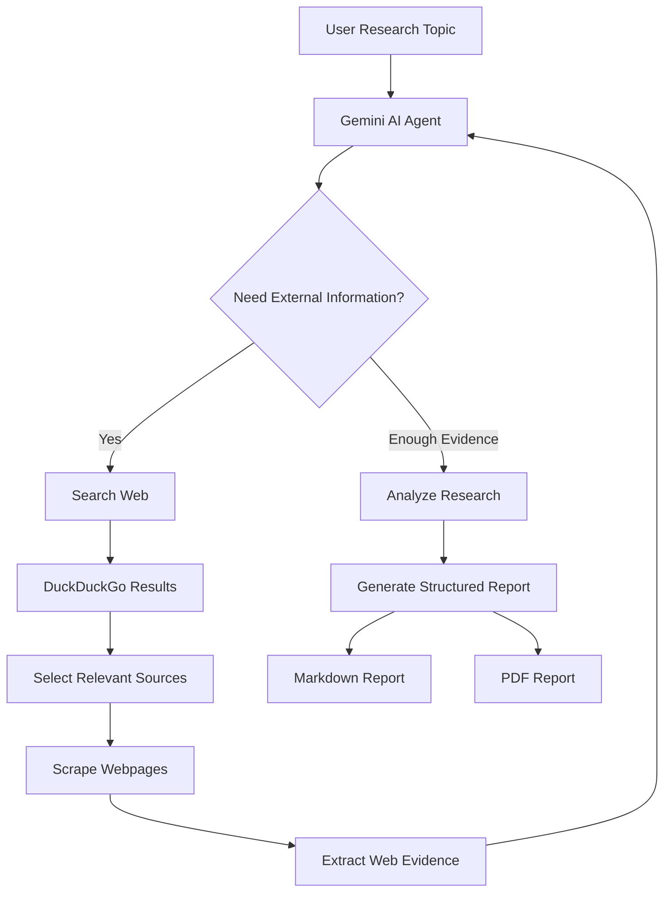

<div align="center">

# 🔎 AI Web Research Agent

### Autonomous Web Research powered by Google Gemini

An intelligent **Agentic AI research assistant** that autonomously searches the web, extracts relevant information, analyzes multiple sources, and generates professional research reports in **Markdown and PDF**.


</div>

---

## ✨ Overview

**AI Web Research Agent** demonstrates how an LLM can act as an autonomous agent rather than simply answering a prompt.

The agent can decide when it needs external information, call web-search and scraping tools, analyze the retrieved evidence, and generate a structured final research report.

```text
Research Topic
      ↓
   Gemini AI
      ↓
 Tool Decision
   ↙       ↘
Search    Scrape
   ↘       ↙
 Web Evidence
      ↓
 AI Analysis
      ↓
Research Report
   ↙       ↘
Markdown   PDF
```

---

## 🚀 Features

* 🤖 **Agentic AI Workflow** — Gemini autonomously decides when tools are required
* 🔎 **Web Search** — Searches the web using DuckDuckGo
* 🌐 **Web Scraping** — Extracts useful information using BeautifulSoup
* 🧠 **AI Analysis** — Gemini analyzes information collected from multiple sources
* 🔄 **Multi-Step Tool Calling** — Supports autonomous search → scrape → analyze workflows
* ⏳ **Automatic Rate-Limit Handling** — Handles Gemini `429 RESOURCE_EXHAUSTED` errors
* 📑 **Structured Reports** — Generates organized research reports
* 📝 **Markdown Export** — Saves reports as `.md`
* 📄 **PDF Export** — Creates formatted PDFs using ReportLab
* 🔐 **Secure API Management** — Gemini API key stored using environment variables

---

## 🧠 How It Works



The agent continues its research loop until it has enough information to generate the final report.

---

## 🛠️ Tech Stack

| Technology        | Purpose               |
| ----------------- | --------------------- |
| 🐍 Python         | Core application      |
| ✨ Google Gemini   | LLM + agent reasoning |
| 🔎 DDGS           | Web search            |
| 🍲 BeautifulSoup4 | Web scraping          |
| 🌐 Requests       | HTTP requests         |
| 📄 ReportLab      | PDF generation        |
| 🔐 python-dotenv  | API key management    |

---

## 📂 Project Structure

```text
AI-Web-Research-Agent/
│
├── app.py
├── requirements.txt
├── .gitignore
├── README.md
│
├── .env                 
├── .venv/               
│
├── research_report.md   # Generated output
└── research_report.pdf  # Generated output
```

---

## ⚙️ Installation

### 1. Clone the repository

```bash
git clone https://github.com/YOUR_USERNAME/AI-Web-Research-Agent.git
```

```bash
cd AI-Web-Research-Agent
```

### 2. Create a virtual environment

```bash
python -m venv .venv
```

### 3. Activate it

**Windows PowerShell**

```powershell
.\.venv\Scripts\Activate.ps1
```

**Windows CMD**

```cmd
.venv\Scripts\activate
```

### 4. Install dependencies

```bash
pip install -r requirements.txt
```

---

## 🔑 Gemini API Setup

Get a Gemini API key from **Google AI Studio**.

Create:

```text
.env
```

Add:

```env
GEMINI_API_KEY=your_api_key_here
```

> ⚠️ Never upload your `.env` file or API key to GitHub.

Your `.gitignore` should include:

```gitignore
.env
.venv/
__pycache__/
*.pyc
research_report.md
research_report.pdf
```

---

## ▶️ Run

Start the research agent:

```bash
python app.py
```

Then enter your research topic:

```text
============================================
AI Web Research Agent
============================================

Enter research topic:
```

For example:

```text
Minimum skills required to get an Agentic AI job
```

The agent will autonomously begin researching.

---

## 🔄 Agent Workflow

The core workflow is:

```text
User
 │
 │ Research Topic
 ▼
┌─────────────────────┐
│   Gemini AI Agent   │
└──────────┬──────────┘
           │
           │ Tool Calling
           ▼
┌─────────────────────┐
│     Web Search      │
│        DDGS         │
└──────────┬──────────┘
           │
           ▼
┌─────────────────────┐
│    Web Scraping     │
│  BeautifulSoup      │
└──────────┬──────────┘
           │
           ▼
┌─────────────────────┐
│ Evidence Collection │
└──────────┬──────────┘
           │
           ▼
┌─────────────────────┐
│   Gemini Analysis   │
└──────────┬──────────┘
           │
           ▼
┌─────────────────────┐
│   Research Report   │
└──────────┬──────────┘
           │
       ┌───┴───┐
       ▼       ▼
   Markdown   PDF
```

---

## 📊 Example Research Topics

```text
Latest developments in Agentic AI

Skills required to become an AI Engineer

AI trends in healthcare

Future of autonomous AI agents

Solid-state battery commercialization

AI adoption in financial services

Comparison of modern AI agent frameworks
```

---

## ⏳ Rate-Limit Protection

Gemini free-tier APIs can enforce request limits.

The application automatically detects:

```text
429 RESOURCE_EXHAUSTED
```

Instead of immediately crashing, the agent waits for the API retry window and attempts the request again.

The research workflow also limits unnecessary searches and tool cycles to reduce API consumption.

---

## 🗺️ Roadmap

Future improvements:

* 🌐 Web-based user interface
* ⚡ FastAPI backend
* 🔗 Automatic citation verification
* 📚 Research history
* 🧠 Multiple LLM support
* 📊 Source reliability scoring
* 🔍 Deep Research mode
* 💾 Database integration
* 📃 DOCX export
* ⚙️ Configurable research depth
* 🚀 Cloud deployment

---

## 🎯 What This Project Demonstrates

This project demonstrates practical knowledge of:

```text
Python
      +
LLM APIs
      +
Function Calling
      +
Tool Use
      +
Web Search
      +
Web Scraping
      +
Agent Loops
      +
Error Handling
      +
Report Generation
      =
Agentic AI Application
```

---

## 🔒 Security

API keys are loaded through environment variables rather than hard-coded into the application.

Never commit:

```text
.env
```

If an API key is accidentally pushed to a public repository, revoke it immediately and generate a new key.

---

## ⚠️ Disclaimer

AI-generated research may contain inaccuracies or rely on third-party web content. Important information should be independently verified before being used for professional, academic, financial, legal, or other high-impact decisions.

---

## 🤝 Contributing

Contributions, suggestions, and improvements are welcome.

1. Fork the repository
2. Create a feature branch
3. Commit your changes
4. Push the branch
5. Open a Pull Request

---

<div align="center">

### ⭐ If you find this project useful, consider giving it a star!

**Built with Python 🐍 + Gemini ✨ + Agentic AI 🤖**

</div>
